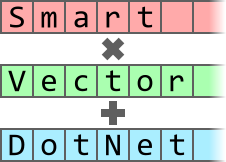

<div align="center">
   
</div>
<div align="center">
   <h1 style="margin-bottom: 0pt;">SmartVectorDotNet</h1>
   <p>SmartVectorDotNet is a library to calculate the sequence by a unified signature with SIMD.</p>
</div>

----

[](https://github.com/aka-nse/SmartVectorDotNet)

[](https://www.nuget.org/packages/akanse.SmartVectorDotNet/)


## Concepts

This library has 3 layers:

1. `ScalarOp`<br/>
   provides generalized and backward-compatibility-enhanced operators and `Math`/`MathF` functions.

2. `VectorOp`<br/>
   provides SIMD parallelized APIs which are corresponding with each method in `ScalarOp` and `Vector<T>` specific operations.

3. `Vectorization`<br/>
   provides span based sequential operation.
   Their APIs are declared as strategy pattern, you can select simple loop or SIMD vectorized operation.

## Usage

### Generalized `System.Numerics.Vector<T>` calculations

`VectorOp` class provides mathematical constants, standard operators, and mathematical elementary functions.

```CSharp
internal class GeneralizeMathFunc : IExample
{
    public void Run(TextWriter logger)
    {
        var x = new Vector<double>([0.0, 1.0, 2.0, 3.0]);
        var sin_x_pi = VectorOp.Sin(VectorOp.Multiply(x, VectorOp.Const<double>.PI));
        logger.WriteLine(sin_x_pi);
    }
}
```

### Simply vectirozation

`Vectorization` class provides batched calculation.

```CSharp
internal class VoctorizeSimply : IExample
{
    public void Run(TextWriter logger)
    {
        var x = Enumerable.Range(0, 256).Select(i => (double)i).ToArray();
        var tmp = new double[x.Length];
        var ans = new double[x.Length];
        Vectorization.SIMD.Multiply<double>(x, Math.PI, tmp);
        Vectorization.SIMD.Sin<double>(tmp, ans);
        logger.WriteLine(string.Join(", ", ans));
    }
}

```

### Vectorization for any function

By to implement `IVectorFormulaX<T>` interface on struct type, you can make any calculation as a batch operation.

```CSharp
internal class CalculateVectorized : IExample
{
    public void Run(TextWriter logger)
    {
        var x = Enumerable.Range(0, 256).Select(i => (float)i).ToArray();
        var y = Enumerable.Range(0, 256).Select(i => (float)i).ToArray();
        var z = Enumerable.Range(0, 256).Select(i => (float)i).ToArray();
        var ans = new float[256];
        Vectorization.SIMD.Calculate<float, Formula>(x, y, z, ans);
        logger.WriteLine(string.Join(", ", ans));
    }
}

file readonly struct Formula : IVectorFormula3<float>
{
    public float Calculate(float x1, float x2, float x3) =>
        x1 * x1 + x2 * x2 + x3 * x3;

    public Vector<float> Calculate(Vector<float> x1, Vector<float> x2, Vector<float> x3) =>
        x1 * x1 + x2 * x2 + x3 * x3;
}
```

### Vectorization for any function with interceptor (*EXPERIMENTAL*)

Required to reference `SmartVectorDotNet.Generators`

```CSharp
internal class CalculateVectorizedInterceptor : IExample
{
    public void Run(TextWriter logger)
    {
        int[] x = [.. Enumerable.Range(0, 1000).Select(i => (int)i)];
        var y = new int[x.Length];
        var z = new int[x.Length];
        var vectorization = new InterceptVectorization(logger);

        vectorization.Calculate(
            static x => x * x,
            x.AsSpan(),
            y.AsSpan()
        );

        vectorization.Calculate(
            static (x, y) => ScalarOp.Add(x, y),
            x.AsSpan(),
            y.AsSpan(),
            z.AsSpan()
        );

        logger.WriteLine(string.Join(", ", z.Take(10)));
    }
}

file class InterceptVectorization(TextWriter logger) : SimdVectorization
{
    protected override void CalculateCore<T, TFormula>(TFormula formula, ReadOnlySpan<T> x1, Span<T> ans)
    {
        logger.WriteLine("Intercepterd by CalculateCore`2(formula, x1, ans)");
        base.CalculateCore(formula, x1, ans);
    }

    protected override void CalculateCore<T, TFormula>(TFormula formula, ReadOnlySpan<T> x1, ReadOnlySpan<T> x2, Span<T> ans)
    {
        logger.WriteLine("Intercepterd by CalculateCore`2(formula, x1, x2, ans)");
        base.CalculateCore(formula, x1, x2, ans);
    }
}
```

## Release notes

### v0.1.0

- first releases

### v0.1.1

- supports custom formula vectorization
- adds `ParallelVectorization` to parallelize vector operation
