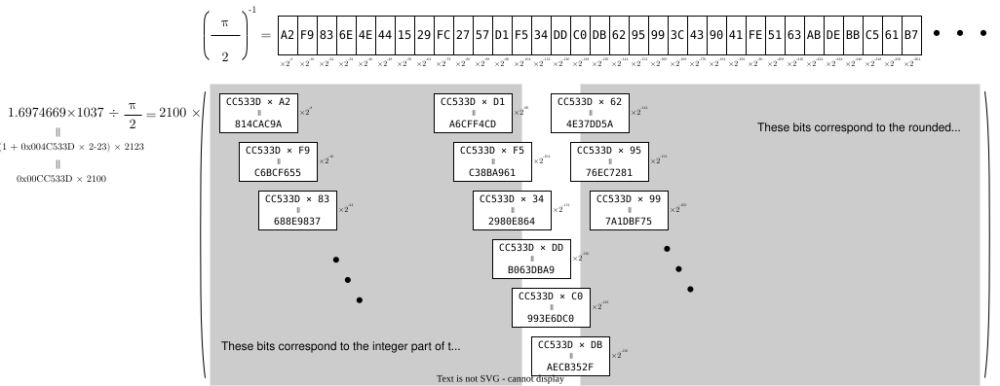

*Author: aka-nse*

# Improvement of accuracy of modulo by constant

For float constant $\alpha$ and float input $x$, we will consider the algorithm to calculate $\beta = x\ \mathrm{mod}\ \alpha$ computationally.

First, the transformation of the formula is performed from a mathematical perspective.

$$
\def\mod{\ \mathrm{mod}\ }
\begin{align*}
& x = \alpha n + \beta \hspace{1em}
\left(\mathrm{where}\ n = \left\lfloor\cfrac{x}{\alpha}\right\rfloor\right)  \\
\Rightarrow &
x\cdot\alpha^{-1} = n + \beta\cdot\alpha^{-1}  \\
\Rightarrow &
\beta =\alpha\left( x\cdot\alpha^{-1} - n \right)
\end{align*}
$$

At then, $\alpha$ is transformed such as following to present computationally.

$$
\begin{align*}
\alpha^{-1}
&= \cfrac{a_1}{2^{8}} + \cfrac{a_2}{2^{16}} + \cfrac{a_3}{2^{24}} + \cdots  \\
&= \sum_{k=1}^{\infty}a_k\cdot 2^{-8\cdot k} \hspace{2em} (a_k \in \{0, 1, 2, \cdots, 255\})
\end{align*}
$$

where $a_k$ is an integer that can be represented using 8 bits.

----

Now, we will consider the example case of $x = 1.6974669 \times 10^{37}$ and $\alpha = \frac{\pi}{2}$[^1] in IEEE 754 binary32 format.

[^1]: For this case, $\frac{\pi}{2}$ is more preferable than $\pi$ as the divisor because $\frac{\pi}{2} = 1.57 \cdots$ and therefore its exponential part is `0`.

They can be transformed as followings:

$$
\begin{align*}
1.6974669 \times 10^{37}
&= (1 + \mathrm{0x4C533D} \times 2^{-23}) \times 2^{123}\\
\left( \cfrac{\ \pi\ }{2} \right)^{-1}
&=  \cfrac{\rm 0xA2}{2^{8}} +
    \cfrac{\rm 0xF9}{2^{16}} +
    \cfrac{\rm 0x83}{2^{24}} +
    \cfrac{\rm 0x6E}{2^{32}} +
    \cfrac{\rm 0x4E}{2^{40}} +
    \cdots
\end{align*}
$$

About $\frac{\beta}{\alpha} = x\cdot \alpha^{-1} - n$,

- the integer part of $x \cdot \alpha^{-1}$ is ignorable because $n = \left\lfloor x \cdot \alpha^{-1} \right\rfloor$,
- the fractional part that exceeds 24 bits, counting from the first significant bit, is ignorable because the fractional part of binary32, including the economized bit, is 24 bits,

therefore followings transformation is available:



$$
\def\mod{\ \mathrm{mod}\ }
{\LARGE\Downarrow}\\
\begin{align*}
x\mod\alpha
&= \alpha\left(x\cdot\alpha^{-1} \mod 1\right) \\
&= \cfrac{\ \pi\ }{2}\cdot\left\{
    1.6974669 \times 10^{37} \times\left(\frac{\pi}{2}\right)^{-1}\mod 1
\right\}  \\
&= \cfrac{\ \pi\ }{2}\cdot\left[\left\{
    \texttt{0xCC533D} \times 2^{100} \times \left(
        \cfrac{\texttt{0xA2}}{2^{8}} +
        \cfrac{\texttt{0xF9}}{2^{16}} +
        \cfrac{\texttt{0x83}}{2^{24}} +
        \cfrac{\texttt{0x6E}}{2^{32}} +
        \cfrac{\texttt{0x4E}}{2^{40}} +
        \cdots
    \right)
\right\}\mod 1\right]  \\
&= \cfrac{\ \pi\ }{2}\cdot\left\{\left(
    \begin{array}{l}
        \left.\begin{array}{lrcl}
             &\texttt{0x814CAC9A} &\times& 2^{100-8}    \\
            +&\texttt{0xC6BCF655} &\times& 2^{100-16}   \\
            +&\texttt{0x688E9837} &\times& 2^{100-24}   \\
            +&\cdots              &      &              \\
            +&\texttt{0xA6CFF4CD} &\times& 2^{100-96}  \\
        \end{array} \color{#DDD}\right\}\color{#000} \textcolor{#DDD}{\rm ignorable}\\[7ex]
        \begin{array}{lrcl}
            +&\texttt{0xC38BA961} &\times& 2^{100-104}  \\
            +&\texttt{0x2980E864} &\times& 2^{100-112}  \\
            +&\texttt{0xB063DBA9} &\times& 2^{100-120}  \\
            +&\texttt{0x993E6DC0} &\times& 2^{100-128}  \\
            +&\texttt{0xAECB352F} &\times& 2^{100-136}  \\
            +&\texttt{0x4E37DD5A} &\times& 2^{100-144}  \\
            +&\texttt{0x76EC7281} &\times& 2^{100-152}  \\
        \end{array}\\
        \left.\begin{array}{lrcl}
            +&\texttt{0x7A1DBF75} &\times& 2^{100-160}  \\
            +&\cdots
        \end{array} \color{#DDD}\right\}\color{#000} \textcolor{#DDD}{\rm ignorable}
    \end{array}
\right) \mod 1\right\}  \\
&\approx \cfrac{\ \pi\ }{2}\cdot\left\{\left(
    \begin{array}{lrcl}
         &\texttt{0xC38BA961} &\times& 2^{-4}  \\
        +&\texttt{0x2980E864} &\times& 2^{-12}  \\
        +&\texttt{0xB063DBA9} &\times& 2^{-20}  \\
        +&\texttt{0x993E6DC0} &\times& 2^{-28}  \\
        +&\texttt{0xAECB352F} &\times& 2^{-36}  \\
        +&\texttt{0x4E37DD5A} &\times& 2^{-44}  \\
        +&\texttt{0x76EC7281} &\times& 2^{-52}  \\
    \end{array}
\right) \mod 1\right\}  \\
&\approx 1.5707964 \times 0.4485327  \\
&\approx 0.7045535
\end{align*}
$$

Therefore this logic can be implemented such as following:

```csharp
private static readonly uint[] ipip2 = [
    0xA2, 0xF9, 0x83, 0x6E, 0x4E, 0x44, 0x15, 0x29,
    0xFC, 0x27, 0x57, 0xD1, 0xF5, 0x34, 0xDD, 0xC0,
    0xDB, 0x62, 0x95, 0x99, 0x3C, 0x43, 0x90, 0x41,
    0xFE, 0x51, 0x63, 0xAB, 0xDE, 0xBB, 0xC5, 0x61,
    0xB7, 0x24, 0x6E, 0x3A, 0x42, 0x4D, 0xD2, 0xE0,
    0x06, 0x49, 0x2E, 0xEA, 0x09, 0xD1, 0x92, 0x1C,
    0xFE, 0x1D, 0xEB, 0x1C, 0xB1, 0x29, 0xA7, 0x3E,
    0xE8, 0x82, 0x35, 0xF5, 0x2E, 0xBB, 0x44, 0x84,
    0xE9, 0x9C, 0x70, 0x26, 0xB4, 0x5F, 0x7E, 0x41,
    0x39, 0x91, 0xD6, 0x39, 0x83, 0x53, 0x39, 0xF4,
    0x9C, 0x84, 0x5F, 0x8B, 0xBD, 0xF9, 0x28, 0x3B,
    0x1F, 0xF8,
];

public static uint ShiftBoth(uint x, int y)
    => y > 0
        ? x << y
        : x >> -y;

public static float ModByPiP2(float x)
{
    Decompose(x, out var sign, out var expo_, out var frac_);
    var frac = ((uint)frac_) | (1u << 23);
    int expo, start;
    expo = expo_ - 127 - 23;
    start = (expo + 7) / 8;

    return (
        + ShiftBoth(frac * ipip2[start + (0 - 1)], expo - (start + 0) * 8 + 32)
        + ShiftBoth(frac * ipip2[start + (1 - 1)], expo - (start + 1) * 8 + 32)
        + ShiftBoth(frac * ipip2[start + (2 - 1)], expo - (start + 2) * 8 + 32)
        + ShiftBoth(frac * ipip2[start + (3 - 1)], expo - (start + 3) * 8 + 32)
        + ShiftBoth(frac * ipip2[start + (4 - 1)], expo - (start + 4) * 8 + 32)
        + ShiftBoth(frac * ipip2[start + (5 - 1)], expo - (start + 5) * 8 + 32)
        + ShiftBoth(frac * ipip2[start + (6 - 1)], expo - (start + 6) * 8 + 32)
    ) * MathF.Pow(2, -32) * (MathF.PI / 2);
}
```

## Accuracy Improvement Measures When the Solution Becomes Very Small

The aforementioned source code provides sufficient accuracy when the solution is relatively large ($\gtrsim 10^{-2}$), but the accuracy decreases as the solution becomes very small.

This is because the number of calculation bits from the starting position of the fractional bits is fixed, effectively making it a fixed-point arithmetic.
To improve accuracy, it is necessary to recognize the position of the first '1' bit in the fractional part and appropriately manipulate the exponent.

Now, as additional example, we will consider the case of $x = 1.2366686 \times 10^{30}$.

It can be transformed as followings:

$$
1.2366686 \times 10^{30} = (1 + \mathrm{0x79BE45} \times 2^{-23}) \times 2^{76}
$$


Then,

$$
\def\mod{\ \mathrm{mod}\ }
{\LARGE\Downarrow}\\
\begin{align*}
x\mod\alpha
&= \alpha\left(x\cdot\alpha^{-1} \mod 1\right) \\
&= \cfrac{\ \pi\ }{2}\cdot\left\{
    1.2366686 \times 10^{30} \times\left(\frac{\pi}{2}\right)^{-1}\mod 1
\right\}  \\
&= \cfrac{\ \pi\ }{2}\cdot\left[\\left\{
    \texttt{0xF9BE45} \times 2^{76} \times \left(
        \cfrac{\texttt{0xA2}}{2^{8}} +
        \cfrac{\texttt{0xF9}}{2^{16}} +
        \cfrac{\texttt{0x83}}{2^{24}} +
        \cfrac{\texttt{0x6E}}{2^{32}} +
        \cfrac{\texttt{0x4E}}{2^{40}} +
        \cdots
    \right)
\right\}\mod 1\right]  \\
&= \cfrac{\ \pi\ }{2}\cdot\left\{\left(
    \begin{array}{l}
        \left.\begin{array}{lrcl}
             &\texttt{9E0A67AA} &\times& 2^{68}  \\
            +&\texttt{F2EA111D} &\times& 2^{60}  \\
            +&\texttt{7FCC5D4F} &\times& 2^{52}  \\
            +&\cdots              &      &              \\
            +&\texttt{F5D74BEC} &\times& 2^{4}  \\
        \end{array} \color{#DDD}\right\}\color{#000} \textcolor{#DDD}{\rm ignorable}\\[7ex]
        \begin{array}{lrcl}
            +&\texttt{260BFC83} &\times& 2^{-4  }  \\
            +&\texttt{54DFA973} &\times& 2^{-12 }  \\
            +&\texttt{CBE45655} &\times& 2^{-20 }  \\
            +&\texttt{EF031809} &\times& 2^{-28 }  \\
            +&\texttt{32BAA604} &\times& 2^{-36 }  \\
            +&\texttt{D7994191} &\times& 2^{-44 }  \\
            +&\texttt{BB4EB3C0} &\times& 2^{-52 }  \\
            +&\texttt{D5A5C507} &\times& 2^{-60 }  \\
            +&\texttt{5F9AD66A} &\times& 2^{-68 }  \\
            +&\texttt{915BBE29} &\times& 2^{-76 }  \\
            +&\texttt{9542B73D} &\times& 2^{-84 }  \\
            +&\texttt{3A88982C} &\times& 2^{-92 }  \\
            +&\texttt{415CCC0F} &\times& 2^{-100}  \\
            +&\cdots
        \end{array}
    \end{array}
\right) \mod 1\right\}  \\
&= \cfrac{\ \pi\ }{2}\cdot\left\{\left(
    \begin{array}{lrl}
            +& \texttt{260BFC8} &\hspace{-1em}\texttt{.3}_{16}                          \\
            +& \texttt{  54DFA} &\hspace{-1em}\texttt{.973}_{16}                        \\
            +& \texttt{    CBE} &\hspace{-1em}\texttt{.45655}_{16}                      \\
            +& \texttt{      E} &\hspace{-1em}\texttt{.F031809}_{16}                    \\
            +& \texttt{      0} &\hspace{-1em}\texttt{.032BAA604}_{16}                  \\
            +& \texttt{      0} &\hspace{-1em}\texttt{.000D7994191}_{16}                \\
            +& \texttt{      0} &\hspace{-1em}\texttt{.00000BB4EB3C0}_{16}              \\
            +& \texttt{      0} &\hspace{-1em}\texttt{.0000000D5A5C507}_{16}            \\
            +& \texttt{      0} &\hspace{-1em}\texttt{.0000000005F9AD66A}_{16}          \\
            +& \texttt{      0} &\hspace{-1em}\texttt{.00000000000915BBE29}_{16}        \\
            +& \texttt{      0} &\hspace{-1em}\texttt{.00000000000009542B73D}_{16}      \\
            +& \texttt{      0} &\hspace{-1em}\texttt{.0000000000000003A88982C}_{16}    \\
            +& \texttt{      0} &\hspace{-1em}\texttt{.00000000000000000415CCC0F}_{16}  \\
            +&\cdots
    \end{array}
\right) \mod 1\right\}  \\
&\approx \cfrac{\pi}{2} \times (\texttt{2661A90.00000046A4AB1CEA5AA31F80F} \mod 1)  \\
&\approx 1.5707964 \times \left(1.644791 \times 10^{-8}\right) \\
&\approx 2.5836316\times 10^{-8}
\end{align*}
$$

In computational terms, additional bit shifts are required when the fractional part of $x\cdot\alpha^{-1}\mod\ 1$ is expected to become very small.

```CSharp
private static readonly uint[] ipip2 = [
    0xA2, 0xF9, 0x83, 0x6E, 0x4E, 0x44, 0x15, 0x29,
    0xFC, 0x27, 0x57, 0xD1, 0xF5, 0x34, 0xDD, 0xC0,
    0xDB, 0x62, 0x95, 0x99, 0x3C, 0x43, 0x90, 0x41,
    0xFE, 0x51, 0x63, 0xAB, 0xDE, 0xBB, 0xC5, 0x61,
    0xB7, 0x24, 0x6E, 0x3A, 0x42, 0x4D, 0xD2, 0xE0,
    0x06, 0x49, 0x2E, 0xEA, 0x09, 0xD1, 0x92, 0x1C,
    0xFE, 0x1D, 0xEB, 0x1C, 0xB1, 0x29, 0xA7, 0x3E,
    0xE8, 0x82, 0x35, 0xF5, 0x2E, 0xBB, 0x44, 0x84,
    0xE9, 0x9C, 0x70, 0x26, 0xB4, 0x5F, 0x7E, 0x41,
    0x39, 0x91, 0xD6, 0x39, 0x83, 0x53, 0x39, 0xF4,
    0x9C, 0x84, 0x5F, 0x8B, 0xBD, 0xF9, 0x28, 0x3B,
    0x1F, 0xF8,
];

public static uint ShiftBoth(uint x, int y)
    => y > 0
        ? x << y
        : x >> -y;

public static float ModByPiP2(float x)
{
    ScalarMath.Decompose(x, out var sign, out var expo_, out var frac_);
    int start;
    int expo = expo_ - 127 - 23;
    int exShift = 0;
    uint frac = ((uint)frac_) | (1u << 23);
    uint zz;
    while (true)
    {
        start = (expo + 7) / 8;
        zz =
            (+ShiftBoth(frac * ipip2[start + (0 - 1)], expo - (start + 0) * 8 + 32)
            + ShiftBoth(frac * ipip2[start + (1 - 1)], expo - (start + 1) * 8 + 32)
            + ShiftBoth(frac * ipip2[start + (2 - 1)], expo - (start + 2) * 8 + 32)
            + ShiftBoth(frac * ipip2[start + (3 - 1)], expo - (start + 3) * 8 + 32)
            + ShiftBoth(frac * ipip2[start + (4 - 1)], expo - (start + 4) * 8 + 32)
            + ShiftBoth(frac * ipip2[start + (5 - 1)], expo - (start + 5) * 8 + 32)
            + ShiftBoth(frac * ipip2[start + (6 - 1)], expo - (start + 6) * 8 + 32)
        );
        if(zz >= 0x800000)
        {
            break;
        }
        var shift = zz switch
        {
            >= 0x8000 => 8,
            >= 0x80 => 16,
            _ => 24,
        };
        exShift += shift;
        expo += shift;
    }
    var z = zz * MathF.Pow(2, -32 - exShift);
    return (sign == 0 ? z : (1 - z)) * (MathF.PI / 2);
}
```

## Application to Values Other Than $\frac{\pi}{2}$

In actual use cases, there are many opportunities to take the remainder with other values such as $2\pi$.
To achieve this, we need to slightly adjust the exponent part.

```CSharp
/// <summary>
/// <c>x % (2^n * PI)</c>
/// </summary>
/// <param name="x"></param>
/// <param name="n"></param>
/// <returns></returns>
public static float ModByPiN(float x, int n)
{
    ScalarMath.Decompose(x, out var sign, out var expo_, out var frac_);
    int start;
    int expo = expo_ - 127 - 23 - (n + 1);
    int exShift = 0;
    uint frac = ((uint)frac_) | (1u << 23);
    uint zz;
    while (true)
    {
        start = (expo + 7) / 8;
        zz =
            (+ShiftBoth(frac * ipip2[start + (0 - 1)], expo - (start + 0) * 8 + 32)
            + ShiftBoth(frac * ipip2[start + (1 - 1)], expo - (start + 1) * 8 + 32)
            + ShiftBoth(frac * ipip2[start + (2 - 1)], expo - (start + 2) * 8 + 32)
            + ShiftBoth(frac * ipip2[start + (3 - 1)], expo - (start + 3) * 8 + 32)
            + ShiftBoth(frac * ipip2[start + (4 - 1)], expo - (start + 4) * 8 + 32)
            + ShiftBoth(frac * ipip2[start + (5 - 1)], expo - (start + 5) * 8 + 32)
            + ShiftBoth(frac * ipip2[start + (6 - 1)], expo - (start + 6) * 8 + 32)
        );
        if (zz >= 0x800000)
        {
            break;
        }
        var shift = zz switch
        {
            >= 0x8000 => 8,
            >= 0x80 => 16,
            _ => 24,
        };
        exShift += shift;
        expo += shift;
    }
    var z = zz * MathF.Pow(2, -32 - exShift);
    return (sign == 0 ? z : (1 - z)) * (MathF.PI / 2) * MathF.Pow(2, n + 1);
}
``` 
