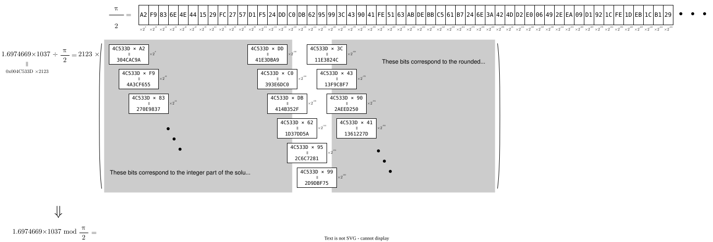

# memos

## $x\ \mathrm{mod}\ \pi$の高精度計算

$x\ \mathrm{mod}\ \alpha = \beta$を考える。

$$
\def\mod{\ \mathrm{mod}\ }
\begin{align*}
& x = \alpha n + \beta \hspace{1em}
\left(\mathrm{where}\ n = \left\lfloor\cfrac{x}{\alpha}\right\rfloor\right)  \\
\Rightarrow &
x\cdot\alpha^{-1} = n + \beta\cdot\alpha^{-1}  \\
\Rightarrow &
\beta =\alpha\left( x\cdot\alpha^{-1} - n \right)
\end{align*}
$$

さて、ここで考慮する$x$は2進浮動小数であるため$x=sp \cdot 2^{q}\hspace{1em}(1\le p \lt 2, q\in\mathbb{Z}, s\in\{-1, 0, 1\})$と表せる。
また、$\alpha^{-1}$を計算機的に表現するため次のように変換する。

$$
\begin{align*}
\alpha^{-1}
&= \cfrac{a_1}{2^{8}} + \cfrac{a_2}{2^{16}} + \cfrac{a_3}{2^{24}} + \cdots  \\
&= \sum_{k=1}^{\infty}a_k\cdot 2^{-8\cdot k}
\end{align*}
$$

